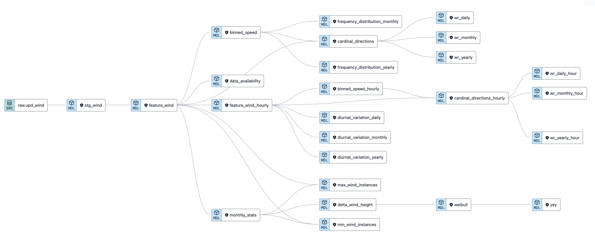

# Wind Energy Dashboard 

This repository holds the project files to build a wind resource assessment dashboard of one particular wind site at the University of the Philippines Diliman designated as Version 1.0

Production for Version 1.0 officially started on Nov 2, 2023 and uses Python 3.12.0

## Data Declaration
The data used in this project was provided by the Energy Engineering 205 course under the Energy Engineering Program at the University of the Philippines Diliman.

This project is purely a educational and training endeavour, and does not aim to infringe on the copyright of the data. 

# Project Overview

The project has three main goals: 
- Conduct a wind resource assessment analysis to demonstrate domain knowledge
- Use python and SQL, either together or separately for the analysis and data visualization to demonstrate skill proficiency
- Use a dashboarding library (Vizro/Streamlit/Dash) to create a custom dashboard to demonstrate skill proficiency

# Domain Knowledge: Wind Resource Assessment
### Data Availability
Not required for the project, however it is important to understand the availability of the data for the entire year, if not simply to avoid the months where data is incomplete for data needed 30/31 days out of a month

Data Needed
- Year
- Month
- Count of Distinct Days Per Month where a wind data record was observed

### Diurnal Variation
The diurnal variation of wind speed provides information about the availability of suitable winds for the entire 24 h of the day. To study this pattern, overall mean hourly values of wind speed should be shown

Data Needed
  - Year
  - Month
  - Day
  - Hour
  - Average Wind Speed per hour

### Wind Rose Diagram 
Another useful way of represtning wind data is the wind rose diagram. A close look at the wind rose and understanding its message correctly is important for siting wind turbines. If  a large share of wind/wind energy comes from a particular direction then the wind turbines should be placed or installed against the direction. 

We can do this with the average wind speeds and wind direcitons per hour, or from the raw wind data itself. Implementations of both will be done.

Data Needed
  - Year
  - Month
  - Day
  - Cardinal Direction 
  - Speed Bins 
  - Count Occuring at Certain Cardinal Direction/Speed Bin Per Day
  - Count Occuring Per Day
  - Percent Frequency 
  - Cumulative Frequency

### Frequency Distribution
Wind Speed is not constant with time. Another way of assessing wind data is the frequency distribution. Modern turbines usually start producing energy above 3.5 m/s, thus the percentage availability of wind above the cutoff speed must be determined. 

Sort wind data according to wind speed and group according to range of wind speed, using 1 m/s intervals. Count the number of occurances per range and divide by the total number of observations

Data Needed
- Year
- Month
- Speed Bin
- Frequency
- Percent Frequency Per Speed Bin

### Wind Speed Distribution aka Weibull Function aka Distribution Function and Periodic Energy Production $YEY(v_m)$
Power from the wind varies with the cube of wind speed. To determine energy output and technical potential, it is important to know the wind speed distribution $f(v)$. 

The Weibull function is the most widely used to represent the distribution of the wind. This function expresses the possibility $f(v)$ to have a wind speed v during a year. This can be represtented by the function below:

$$f(v) = \frac {\pi v}{2{(v_m)}^2} exp (\frac{\pi}{4}) (\frac{v}{v_m})^2$$

For the purpose of our analysis, we will set v in f(v) to be the same speeds seen in the power curve, p(v) of our reference turbine. 

#### Periodic Energy Production  
When you combine the distribution function and the powercurve of a reference turbine, the periodic energy production can be calculated by integrating the power output at every bin width. 

$$YEY(v_m) = \sum_{v=1}^{25} f(v)P(v)8760$$

Data Needed
- Year
- Month
- Wind Shear 
- Wind Turbine Speeds
- p(v)
- f(v)
- f(v) * p(v) * 24 for Daily Energy Production
- f(v) * p(v) * 8760 for Yearly Energy Production

$YEY(v_m) = \sum_{v=1}^{25} f(v)P(v)24$
$YEY(v_m) = \sum_{v=1}^{25} f(v)P(v)8760$

## Requirements
Graphs
- Averaged Diurnal Variation : 1 diagram per day for selected month
- Windrose Diagram for average 24 hours : 1 diagram per day for selected month
- Frequency Distribution of the Wind Intensities : 1 graph for whole month

Compute
- Basic Statistics (min, max, ave). In which period do these values occur
- Wind Shear and YEY
  - The Melchor Hall rooftop is approximately 84 meters above the ground. The anemometer is installed 2 m above the rooftop. What is the theoretical wind energy potential on this site if a 20 m wind turbine is installed using a mast 25 meters above the rooftop? What will be the total energy yield for a day? Assuming the distribution holds for the year, compute for 𝑌𝐸𝑌(𝑣𝑚).
  - Wind Shear
  - YEY for a day
  - YEY for a year

Answer
- Describe the directional characteristics of wind in your site. In which direction are maximum speeds dominant? In General, higher values are observed during daytime and smaller values during evening and night hours. Is this true for your site. 
- The Weibull function can also be approximated as:

$$f(v) = (\frac {k}{A}) (\frac {v}{A})^{k-1} exp - (\frac {v}{A})^k$$

Where 
$$ A = \frac {2}{\sqrt \pi}v_m$$

# Analysis, Visualization, and Dashboarding

## Analysis

- Pure Excel Analysis 
- Pure Python Using Pandas Dataframes
- The use of SQL for most of the analysis. There are several sub-categories for this:
  - Use of tools like pgAdmin and SQLTools Extension in VS Code to do raw SQL 
  - Use of sql connectors like psycopg
  - Use of sql ORMs like sqlalchemy
  - Use of sql magic commands
- Use of a datawarehouse like Google Bigquery

For this work, we will be using SQL magic commands. 

The workflow is as follows:
- Setup a postgresql server instance on the local machine
- Create a database, schema, and table 
- Copy data from a clean csv of the wind data into the table
- Query the data using the tool we chose (sql magic commands)
- Transform the ResultSet Objects into dataframes for visualization and dashboarding

## Visualization

There are several python libraries for visualization 
- Matplotlib
- Seaborn
- Plotly
- Bokeh
- etc

For our purposes, we will be using Plotly for its interactivity and ease of downloading the result figures as pngs. 

Specifically, we will be using the implementation of plotly in the dashboarding tool we will use, Vizro. 

## Dashboard

### Vizro

Vizro is a wrapper of Dash, which is a wrapper of Flask. It was released in September, 2023. And I started using it Nov 8-9, 2023

Its pretty useful because it filters the data visualization being shown based on certain controls that you set.

#### Vizro Project Structure

It is structured similarly to a dash app

# Streamlit: Dashboard Project

This project can also be implemented in stramlit

#### Streamlit Project Structure
- .streamlit/
  - config.toml
- app.py
- requirements.txt
- setup.sh
- data/
  - dataset.csv
- modules/  
  - data_loader.py
  - helper_function.py
- pages/
  - overview.py
  - details.py
  - settings.py
- static/
  - images/
    - logo.png
  - stles/
    - custom.css
  - js/
    - script.js
- templates/
  - custom_template.html

It uses a virtual environment, with packages seen in the requirements.txt file. 

An additional folder is the notebooks-sql folder which holds all the notebooks where most of the development actually took place. 

A brief description of the roles/parts of the streamlit app can be seen below. 

- app.py is the main entry point of the streamlit app
- .streamlit/config.toml optional configuration file for setting up thigns like theme, page title, etc. 
- requirements.txt a list of python packages that are required for the app to run
- setup.sh an optional shell script that can be used to setup environment variables or streamlit setting when deploying
- data/ directory for storing data fiels such as csvs, excel files, or sqlite databases
- modules/ if the app has complex functionality, code can be organized into modules and import them in app.py
- pages/ for a multi-page app, each scrip represents a different page in the dashboard
- static/ holds static assets like images, css files for styling, and javascript files if necessary
- templates/ if you need custom HTML templates

# Project Setup
- Create new repository on Github
- Create .gitignore file for **/.DS_Store, .vscode/, .virtual_environment
- Create relevant folders/files for dashboard project
- Create virtual environment using `python3 -m venv wind_dashboard`
- Activate using `source wind_dashboard/bin/activate`
  - Deactivate using `deactivate`
- Populate requirements.txt and install via `pip3 install -r requirements.txt` to virtual environment

# Hosting

